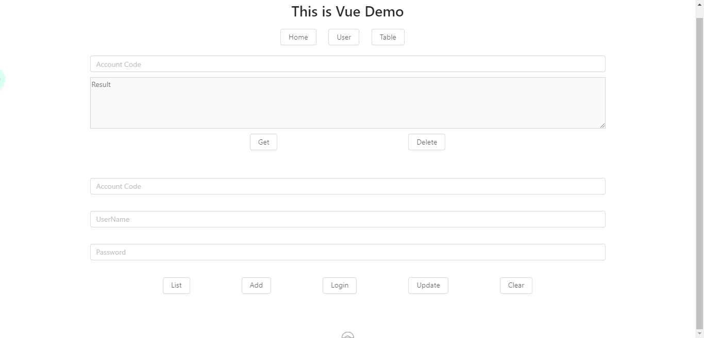
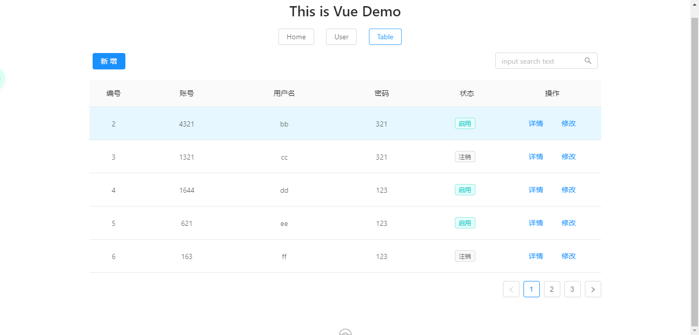

## 前后端分离工程
### 一、介绍
    - 前端：Vue + Ant Design。

    - 后端：Spring Boot RESTful
    
    - 前后端数据交互：Axios。
      
    - 数据库优化：Redis缓存。


### 二、页面预览




### 三、数据表脚本
```sql
CREATE TABLE `tb_user`  (
`id` int(11) NOT NULL AUTO_INCREMENT,
`account_code` varchar(10) CHARACTER SET utf8 COLLATE utf8_general_ci NOT NULL,
`username` varchar(52) CHARACTER SET utf8 COLLATE utf8_general_ci NULL DEFAULT NULL,
`password` varchar(30) CHARACTER SET utf8 COLLATE utf8_general_ci NULL DEFAULT NULL,
`is_delete` int(11) NULL DEFAULT NULL,
PRIMARY KEY (`id`) USING BTREE
) ENGINE = InnoDB AUTO_INCREMENT = 3 CHARACTER SET = utf8 COLLATE = utf8_general_ci ROW_FORMAT = Dynamic;
```


